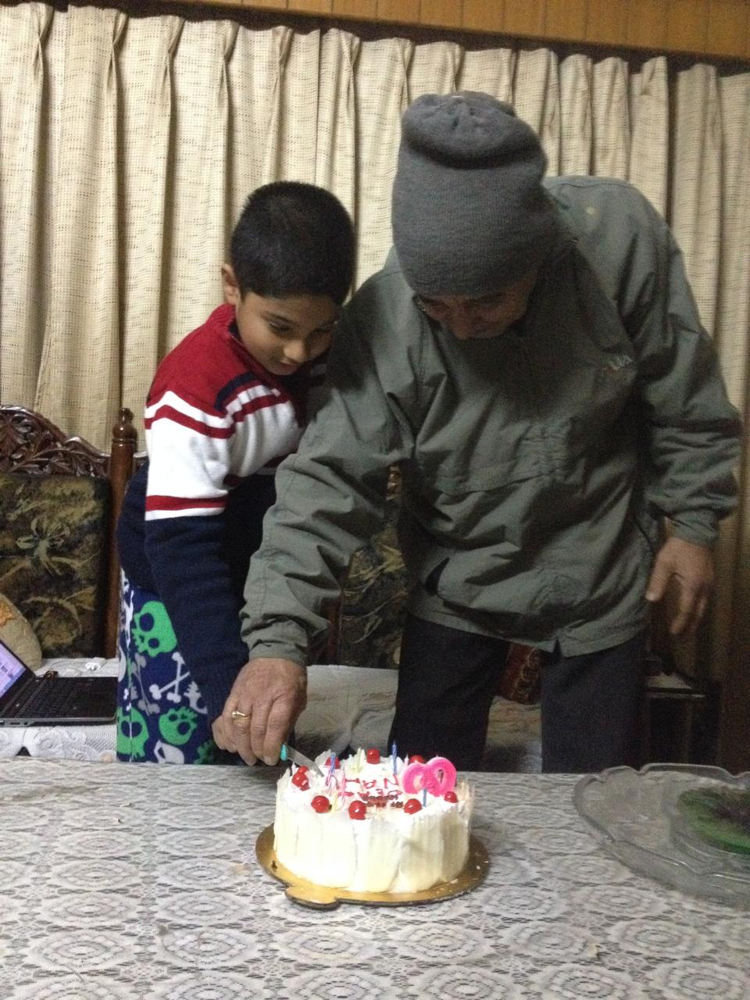

## About Me

I am an undergraduate at [UCLA](https://www.ucla.edu) studying *Applied Mathematics & Computer Engineering*. I am a current Machine Learning intern at [NASA](https://www.nasa.gov/glenn/) for Summer 2026 exploring scientific machine learning for deep space applications. Recently, I have been exploring Deep Reinforcement Learning and SystemVerilog on FPGA. Two very different interests but they're quite fascinating. This is a small website that holds some important things that I think are worth sharing.

## Currently
- Research in Fine-tuning Large Language Models for Scientific Computing with [Ryan Anderson](https://ryan-a-anderson.github.io), Ph.D. Student, UCLA MathML Group.
- I attended [AI Agents as Universal Task Solvers](https://ww3.math.ucla.edu/thursday-colloquium/) at UCLA Mathematics Thursday Colloqium by [Stefano Soatto]([https://web.cs.ucla.edu/~soatto/](https://en.wikipedia.org/wiki/Stefano_Soatto)) and [Alessandro Achille](https://alexachi.github.io).
- I am reading [Reinforcement Learning](http://incompleteideas.net/book/the-book-2nd.html) by Richard Sutton & Andrew Barto to prepare for a Math 199: Directed Research in Mathematics for Winter 2027.
- Working on compiling a large repository of ideas in Machine Learning for undergraduates across various disciplines from a mathematical standpoint.

## Research Interests

My research interests lie in [deep reinforcement learning](), [computer vision](), [computability theory]() and [computer systems architecture](). I am passionate about learning the underlying theory as well as seeing how frontier research can bring positive impact.

## Services

- **Research Assistant**: UCLA Mathematical Machine Learning Group (advised by [Guido Montufar](https://www.math.ucla.edu/~montufar/))
- **Teaching Assistant:** UCLA Mathematics, Calculus II (Math 31B with [Casey Johnson](https://www.math.ucla.edu/people/visiting/casey)) and Honors Linear Algebra (Math 115AH with [William Conley](https://www.math.ucla.edu/~wconley/))
- **Workshops Officer:** ACM AI--Association of Computing Machinery in Artificial Intelligence (Fundamentals of Machine Learning Theory, Computer Vision & Natural Language Processing, Modern Methods in Frontier Artificial Intelligence)

## Personal Interests & Hobbies

1. i like playing competitive sudoku on sudoku.coach
2. i enjoy backpacking and camping. my favorite state park is big sur and my favorite national park is joshua tree
3. cats, cats, cats
4. i like playing soccer, table tennis and pickleball
5. the strokes, daft punk, iron maiden, pink floyd, led zeppelin and blue öyster cult are some of my favorite bands  



## Friends

check out my friends' profiles!

- [Max Cabilangan](https://maxercaber.github.io), Political Science, Ling/CS, UCLA '27
- [Sahan Wijetunga](https://sahanwijetunga.github.io), Pure Math, UCLA '28
- [Rithwik Sharma](https://www.rithwiksharma.com), Computer Engineering, Georgia Tech '28
- [Pavit Gogia](https://www.linkedin.com/in/pavit-gogia-8a276a265/), Computer Science & Biz, TCD '28
- [Shashwat Joglekar](https://www.linkedin.com/in/shashwat-joglekar-3917a5255/), Physics & Math, UIUC '28
- [Nikhil Dewitt](https://www.linkedin.com/in/nikhildewitt/), Computer Science, UCLA '27
- [Brandon Tran](https://www.linkedin.com/in/brandontranucla/), Psychobiology, UCLA '28
- [Pierre-Louis Nguyen](https://www.linkedin.com/in/pierre-louis-nguyen-59b418301/), Pure Math, UCLA '28
- [Da-Yi Wu](https://www.linkedin.com/in/da-yi-w-02671628b/), Applied Math, UCLA '28

## Photos

Below are a few photos that I think are worth sharing :D

a photo of my nanu and i on his birthday

nasa glenn research center, where i am (currently) interning at for summer 2026 :D

a picture of my mom and i in san francisco (the best city on the planet)

my dad and i at a family member's wedding

a photo of my mausi and i at oxford street in london

the milkyway from my iphone during a backpacking trip to joshua tree national park

my friends and i at the sears tower in chicago (it was -15 degrees, very cold)

cat :D

a photo of my mausi (another one!) and me at stanford university

pavit came to visit me all the way from ireland to ucla :O

the sky! and the eiffel tower i guess...

<!--  -->
